# 🦸‍♂️ [FastAPI-SuperHero](https://fastapi-superhero.onrender.com) 🦸‍♂️

___


## 📄 Project Description
FastAPI-SuperHero is a web application where users can:
- 🔒 Log in through email (dummy email works fine) and password, or sign up, or log in as a guest.
- 🦸‍♂️ Create heroes with names and alter-egos (e.g., Spiderman and Peter Parker).
- 👀 View all heroes, view individual hero details, and like heroes (both their own and others).
- 👤 View and manage their profile and delete their heroes or profile.

## 📦 Installation Instructions
> Note: The application is hosted publicly on https://fastapi-superhero.onrender.com

## 🚀 To run the project locally:

1. **Clone the repository:📁** 

```bash
git clone https://github.com/username/repository.git
cd repository
```

2. **Install dependencies:💻**

```bash
pip install -r requirements.txt
```

3. **Set up the database:📈**
- Ensure you have CockroachDB set up and running.
- Configure the database URL in your project settings.

4. **Run the application:🚀**

```bash
uvicorn main:app --reload
```

5. **Usage📊**

Simply use the provided weblink to access the application. For now, it is turned off due to cost issues but can be activated upon request.

6. **Screenshots📸**

Below are screenshots of the application on both desktop and mobile views:

- Welcome Page:🎉
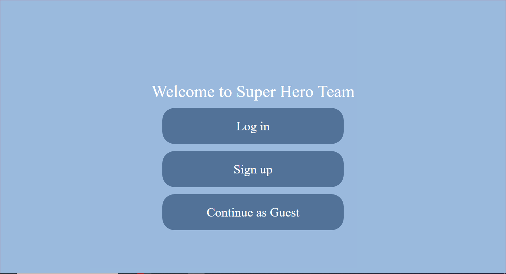
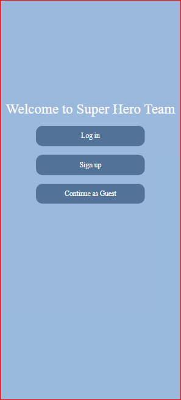

- Login Page:🔒
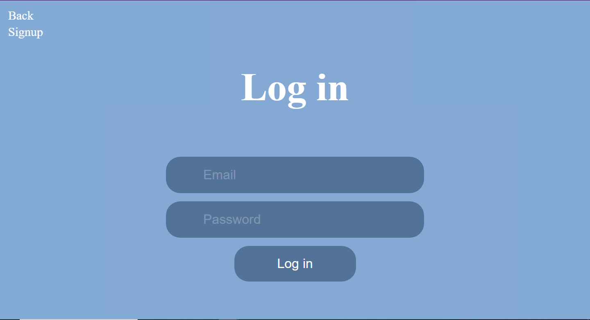
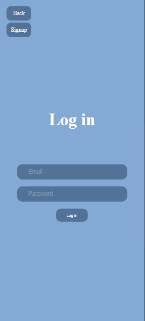


- Signup Page:📝
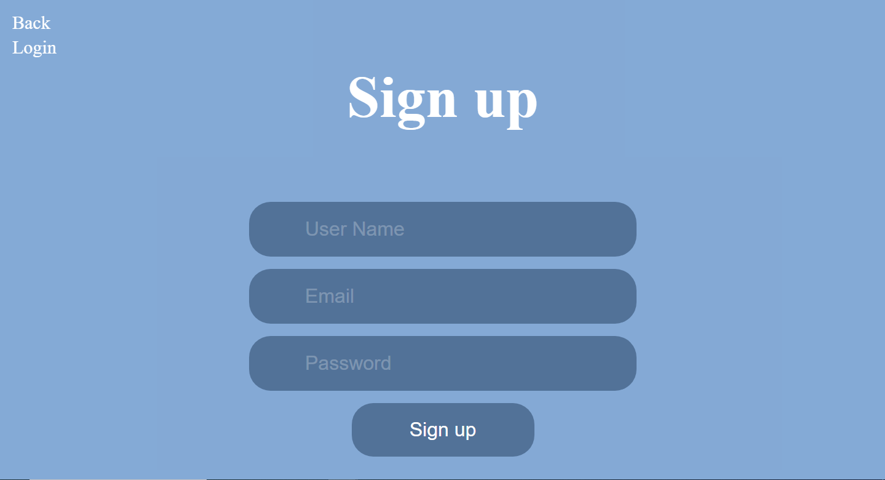
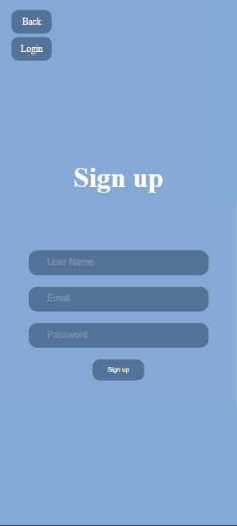


- View All Heroes:👥
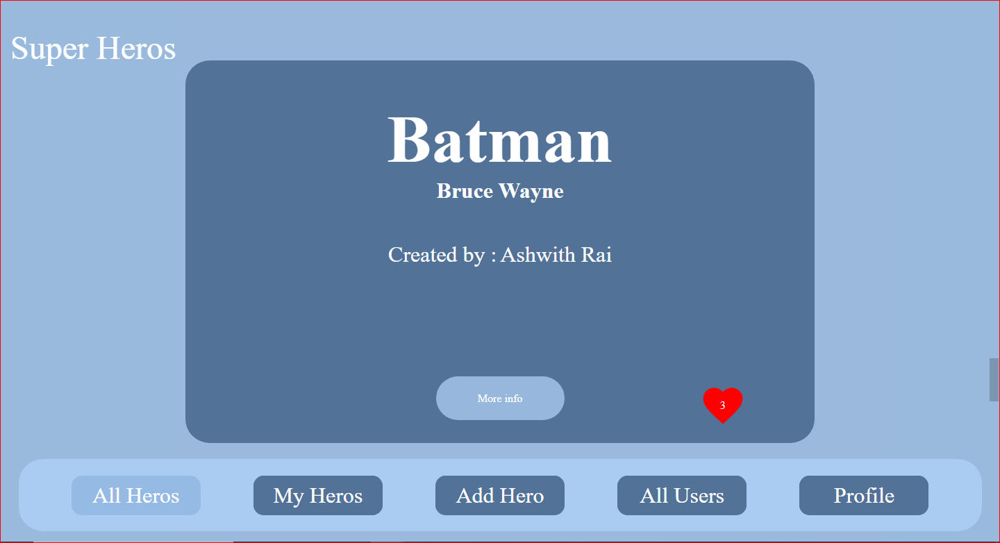
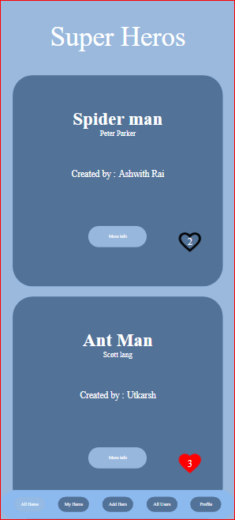


- Add Hero:🦸‍♂️
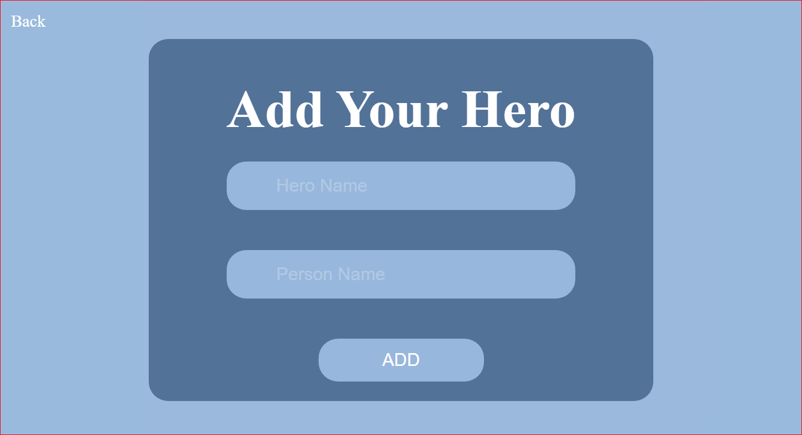


- Hero Details:📊


- User Profile:👤
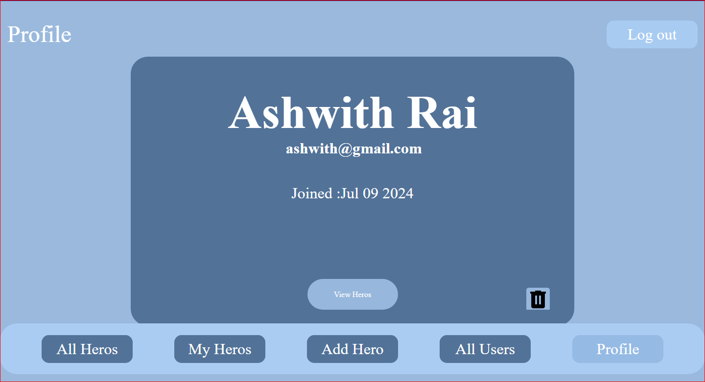
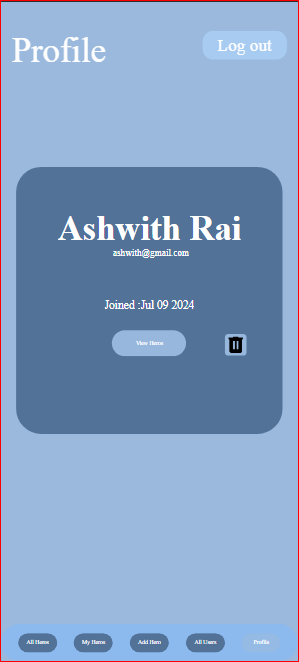


7. **Technologies Used 💻**

- Backend: Python (FastAPI)
- Frontend: HTML, CSS, JavaScript
- Database: CockroachDB
- ORM: SQLAlchemy
- Template Engine: Jinja2

8. **Features 🎉**

- Login, signup, and guest access
- Create, view, and delete heroes
- View user profiles
- Like heroes
- Responsive design for desktop and mobile

9. **Future Improvements 🚀**

- Edit heroes and profiles
- Add comments
- Email authentication
- Search hero functionality
- Pagination for heroes

10. **Contributing 🤝**

At this time, contributions are not required. (you can contact me ,if you insist 😜)

11. **License📝**
- This project does not have a license.

12. **Contact Information**
For any questions or feedback, you can reach me on:

* [Instagram](https://www.instagram.com/ashwith_rai_0404?igsh=Z2Z2cDdyZXA5aGky)
* [Telegram](https://t.me/raiashwith)
* [WhatsApp](https://wa.me/qr/XNYXIBVEI24UK1)
